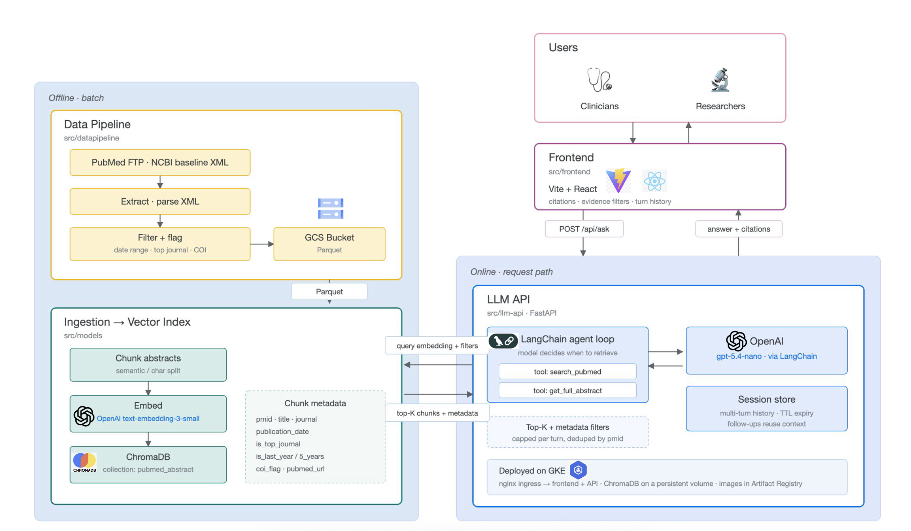
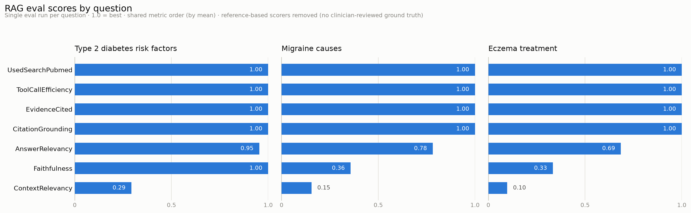

# The Consult

Generative AI assistant that delivers referenced, clinically aware answers for clinicians
and researchers. It pairs OpenAI (via LangChain) with RAG over PubMed-derived content, so
answers carry citations, study details, and configurable evidence filters. Conversation turns are logged to Braintrust.

## Demo

<video src="https://github.com/user-attachments/assets/2ef237b4-b233-47af-8b5b-3c323535b66e" controls width="600"></video>

## Architecture



Two halves. **Offline**, the data pipeline pulls PubMed baseline XML, filters and flags it,
and lands Parquet in GCS; ingestion then chunks, embeds, and indexes those abstracts into
ChromaDB. **Online**, the API runs a LangChain agent loop that decides when to retrieve —
calling `search_pubmed` against the index and `get_full_abstract` for detail — then answers
with citations.

## What's inside

| Path | What it is |
|---|---|
| `src/llm-api` | FastAPI service: RAG over ChromaDB, OpenAI generation, streaming, multi-turn sessions |
| `src/frontend` | Vite/React client — renders answers, citations, and filters |
| `src/models` | RAG tooling: chunking, embeddings, ChromaDB ingestion, query CLI |
| `src/datapipeline` | PubMed ingestion: NCBI FTP download → parse → filter → Parquet |
| `src/deployment` | Pulumi programs + Dockerfiles for deploying to GCP (images + GKE) |
| `src/workflow` | ML workflow CLI driving Vertex AI pipelines |
| `tests/` | Integration and system tests (unit tests live in each module) |
| `.github/workflows` | CI/CD and ML pipelines |
| `docs`, `screenshots` | Design docs, workflow/coverage screenshots |

## Run locally

Requires **Python 3.12**, **Node 18+**, **Docker**, and an **OpenAI API key**.

Three processes make up the running app: ChromaDB (vector store, port 8000), the
API (port 8081), and the frontend (port 8080). Run steps 4–6 in separate terminals.

### 1. Install dependencies

```bash
python -m venv .venv && source .venv/bin/activate
pip install uv && uv sync

cd src/frontend && npm install && cd ../..
```

### 2. Create a `.env` in the repo root

`.env` is gitignored, so a fresh clone won't have one:

Only `OPENAI_API_KEY` has no default — everything else below is written out so the
knobs are visible in one place rather than buried in source:

```bash
cat > .env <<'EOF'
# LLM + embeddings
OPENAI_API_KEY=sk-...
OPENAI_MODEL=gpt-5.4-nano
EMBEDDING_MODEL=text-embedding-3-small
EMBEDDING_DIMENSION=1536

# Vector store
CHROMADB_HOST=localhost
CHROMADB_PORT=8000

# Retrieval + agent tuning
CHROMADB_TOP_K=20
CHROMADB_CANDIDATE_K=20
CHROMADB_FILTERED_TOP_K=5
TOOL_MAX_ITERATIONS=4

# API
API_ALLOW_ORIGINS=http://localhost:8080

# Tracing + evals (omit to run without Braintrust)
BRAINTRUST_API_KEY=sk-...
BRAINTRUST_PROJECT=The Consult

# Only needed to ingest Parquet from GCS (src/models, src/datapipeline)
GOOGLE_APPLICATION_CREDENTIALS=/absolute/path/to/service-account.json
GCP_PROJECT=your-project-id
PROJECT_BUCKET_NAME=your-bucket
PARQUET_SOURCE_PREFIX=input-parquet-topj-5yr
ENABLE_GCS_BACKUP=false
EOF
```

| Variable | Default | Purpose |
|---|---|---|
| `OPENAI_API_KEY` | — | **Required.** Chat completions and embeddings |
| `OPENAI_MODEL` | `gpt-5.4-nano` | Chat model |
| `EMBEDDING_MODEL` / `EMBEDDING_DIMENSION` | `text-embedding-3-small` / `1536` | Must match whatever the index was built with |
| `CHROMADB_HOST` / `CHROMADB_PORT` | `localhost` / `8000` | Vector store connection |
| `CHROMADB_TOP_K` / `CHROMADB_CANDIDATE_K` | `20` / `20` | Vector-similarity fetch size, before filtering |
| `CHROMADB_FILTERED_TOP_K` | `5` | Citations kept per search **and** per turn |
| `TOOL_MAX_ITERATIONS` | `4` | Cap on tool-calling rounds in one turn |
| `API_ALLOW_ORIGINS` | `localhost:8080` | Comma-separated CORS origins |
| `BRAINTRUST_API_KEY` | unset | Enables tracing and is required by the evals; unset makes tracing a no-op |
| `BRAINTRUST_PROJECT` | `The Consult` | Dashboard project for traces and eval experiments |
| `EVAL_SCORER_MODEL` | `gpt-5.4-mini` | Judge model for the LLM-based eval scorers |
| `GOOGLE_APPLICATION_CREDENTIALS` | unset | Service-account key — GCS ingestion only, unrelated to the LLM path |
| `GCP_PROJECT` / `PROJECT_BUCKET_NAME` / `PARQUET_SOURCE_PREFIX` | see `src/models` | Where the Parquet corpus is read from |
| `ENABLE_GCS_BACKUP` | `true` | Whether ingestion writes a JSONL backup to GCS |

> Both the API and the `src/models` tooling load this file automatically on startup.
> Variables already set in the environment take precedence, so Docker/Kubernetes config
> always wins over `.env`.

A few further knobs are read but deliberately left out above: session expiry
(`SESSION_TTL_SECONDS`, `SESSION_CLEANUP_INTERVAL_SECONDS`) and ingestion tuning
(`CHROMADB_BATCH_SIZE`, `EMBEDDING_BATCH_SIZE`, `BACKUP_PREFIX`, …) have sane defaults and
are documented where they're used, in [`src/models/README.md`](src/models/README.md).
**Don't set `ROOT_PATH` locally** — it's the `/api-service` ingress prefix used only when
deployed behind nginx, and setting it will make every local request 404.

### 3. Start ChromaDB

The compose file attaches to an external Docker network, so create it first:

```bash
docker network create llm-rag-network

cd src/models
docker compose up -d chromadb
cd ../..
```

Data persists in `src/models/docker-volumes/chromadb`, so it survives restarts.

### 4. Load data into ChromaDB

A fresh ChromaDB is empty — the app will run but return no citations. To populate it,
follow [`src/models/README.md`](src/models/README.md). The Parquet files it ingests are
produced by the pipeline in [`src/datapipeline/README.md`](src/datapipeline/README.md).

### 5. Start the API

```bash
uvicorn api.server:app --app-dir src/llm-api --host 0.0.0.0 --port 8081 --reload
```

Check it: `curl http://localhost:8081/healthz`

### 6. Start the frontend

```bash
cd src/frontend && npm run dev -- --host --port 8080
```

Open **`http://localhost:8080`**. The UI reads its API URL from
`src/frontend/.env` (`VITE_API_BASE_URL=http://localhost:8081`), which is
committed, so no extra config is needed.

### Alternative: containerized

Each module ships a `./docker-shell.sh` that builds and drops you into a container
with its dependencies — available for `src/llm-api`, `src/frontend`, `src/models`,
and `src/datapipeline`.

## Evaluations

The chatbot was evaluated on three search queries:

1. *"What are common risk factors for type 2 diabetes?"*
2. *"What causes migraines?"*
3. *"How do you treat eczema?"*



Runs were scored via [`src/llm-api/evals/eval_rag.py`](src/llm-api/evals/eval_rag.py) against
real ChromaDB and OpenAI, logged to Braintrust. Four scorers are deterministic Python over
the tool-call trajectory (`UsedSearchPubmed`, `ToolCallEfficiency`, `CitationGrounding`,
`EvidenceCited`); three are LLM judges from `autoevals` (`Faithfulness`,
`ContextRelevancy`, `AnswerRelevancy`).

Every question searched before answering, issued no redundant
queries, cited the evidence it retrieved, and used only citation numbers that
exist — all four deterministic scorers hit 1.00 on all three questions. `AnswerRelevancy`
(0.69–0.95) indicates the answers address what was asked.

However, `ContextRelevancy` scores between 0.10 and 0.29 — this means
most retrieved chunks aren't relevant to the question. The eczema run is the clearest
example: alongside two atopic-dermatitis papers it pulled a vitiligo topical-therapy paper,
a dry-eye review, and a murine airway study. Vector similarity over abstract chunks is
matching on shared vocabulary rather than on the actual topic.

`Faithfulness` (0.33–1.00) tracks that directly: when retrieval misses, the model answers
correctly from internal knowledge instead, so the answer is good but not grounded enough in the
cited evidence.

Each run is asin gle run of one question, and the
three LLM-judged scorers are themselves stochastic, so treat differences of a few points as
noise. And the reference-based scorers (`ContextPrecision`, `ContextRecall`,
`AnswerCorrectness`) were deliberately removed: they need clinician-reviewed ground truth
written from the indexed corpus.

**The most promising next step is improving retrieval: the chunking strategy, a final reranking stage, or a hybrid keyword (such as BM25) + vector search.**


## Testing

```bash
pytest src/llm-api/tests        # unit
pytest src/models/tests         # unit
pytest tests/integration        # integration
pytest tests/system             # system (needs the API running)

cd src/datapipeline && uv run pytest tests/   # unit, run from its own venv
```

## Deploy to GCP

📖 **See [`src/deployment/README.md`](src/deployment/README.md)** for the complete
walkthrough: creating the GCP project, enabling APIs, service-account roles, running
both Pulumi stacks, cost estimates, and teardown.

⚠️ Deploying provisions a GKE cluster that bills hourly (roughly $150–220/month if
left running). The guide covers costs and how to tear everything down.

## CI/CD

| Workflow | Trigger | What it does |
|---|---|---|
| `ci-cd-main.yml` | Push/PR to `main` or `develop` | Lint (Black + Flake8), unit, integration, and system tests |
| `app-ci-cd-gcp.yml` | `/deploy-app` in commit message | Builds images, runs Pulumi, deploys to GKE |
| `ml-ci-cd-gcp.yml` | `/run-*` in commit message | Submits Vertex AI pipeline jobs |

`ml-ci-cd-gcp.yml` sub-triggers: `/run-data-collector`, `/run-data-processor`,
`/run-ml-pipeline`.

The deployment and ML workflows need these configured as GitHub secrets or shell env:
`GCP_PROJECT`, `GCS_SERVICE_ACCOUNT`, `PULUMI_BUCKET`, and `GOOGLE_APPLICATION_CREDENTIALS`
(path to that service account's JSON key).

## Issues and limitations

- Study-type and evidence-quality filters were scoped but not built.
- Fine-tuning for clinical/research tone remains a work in progress.
- RAG can be improved via hybrid search, a reranking stage, and adding more data.
- User modes are limited to research vs. clinical; more specific personas are future work.

### Testing gaps

- `src/datapipeline` unit tests cover only the filter/flag transforms in
  `upload_pm_abstract_ftp.py` — the FTP download and XML parse steps are untested, and no
  CI workflow runs this suite yet.
- Coverage reports (see `screenshots/`) show weak spots: `get_chromadb_collection()`,
  `query_documents()`, `get_index()`, `health_check()`, and `build_context_and_citations()`
  in `src/llm-api`; `query_rag_model.py` and `src/gcs.py` in `src/models`.
- GitHub artifact storage limits have kept the HTML coverage reports from being regenerated
  recently.
